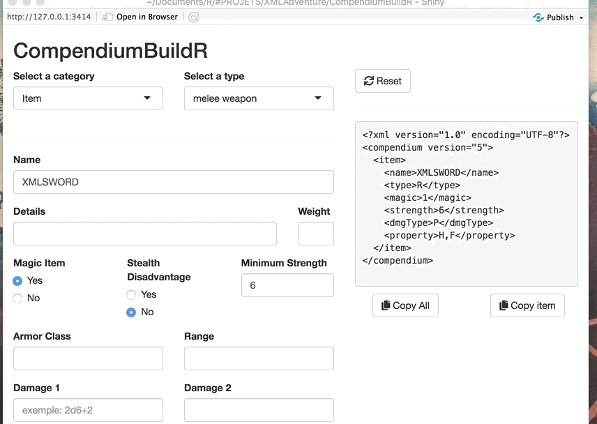

# XMLAdventure

A Shiny App to build xml compendium elements. The xml Outputs follow the Lion's Den style guide so you can easily import it to the app.

## Features

## General Principle
Fill in preformated inputs to generate an xml that you can copy/paste into your compendium files.

### Create

- Choose a a category of element to add (only items for now)
- Fill the various inputs (at the moment, only items are supported)

### Save (copy/paste)

Use the buttons to copy the text output. You can choose either the whole structure or just the element.

### Reset

Change type or category to reset all the inputs or 

## Technical details

This app is based on the [R](https://www.r-project.org) language and its [Shiny package](https://shiny.rstudio.com), developped by [RStudio](https://github.com/rstudio/shiny).

## TODO
  - [ ] Build a POC
  - [ ] Get Feedbacks
  - [ ] Publish on shinyapps.io for free and easy access
  - [ ] Support other category of element
  - [ ] (maybe) adapt inputs depending on types within a category

## Milestones